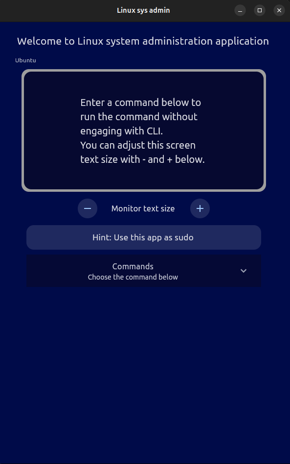

# Ubuntu Manager


## 📌 Overview
**Ubuntu Manager** is a **Python-based** GUI application built using the **Flet framework**. It provides an interactive and user-friendly interface for managing users and groups on Ubuntu-based systems.

## ⚡ Features
- 🌐 **Network management** using `nmcli`.
- 📡 **Display network interfaces** using `ifconfig`.
- 💾 **Monitor disk usage**.
- 👥 **View logged-in users** with `who`.
- 🔍 **Check current user** with `whoami`.
- 🕒 **Display system date and time**.
- 🔒 **Secure user management** with sudo privileges.
- 🖥️ **Modern GUI** built with **Flet**.

## 📸 Screenshot

## 🚀 Installation
Clone this repository and navigate to the project directory:

```bash
# Clone the repository
git clone https://github.com/sepehrmdn77/ubuntu_manager.git
cd ubuntu_manager
```

## ▶️ Usage
Ensure you have Python installed, then install dependencies and run the application:

```bash
pip install flet  # Install required library
python src/sys_admin.py  # Run the application
```

## ⚙️ Requirements
- Ubuntu/Linux system
- Python (3.8+ recommended)
- **Flet** framework (`pip install flet`)
- Sudo privileges for user management tasks

## 🛠️ Configuration
- Modify the script as needed to customize user and group settings.
- Ensure the script has the necessary permissions to execute administrative tasks.

## 🤝 Contributing
Contributions are welcome! Feel free to fork the repository and submit a pull request.

## 📬 Contact
For issues or feature requests, please open an issue in the repository or reach out at [sepehrmaadani98@gmail.com].